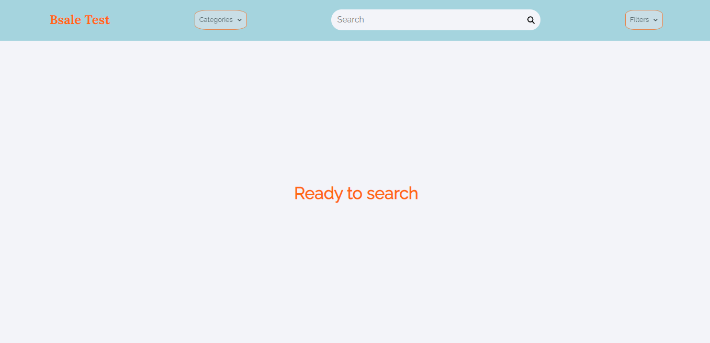
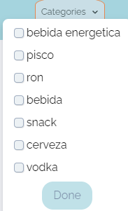
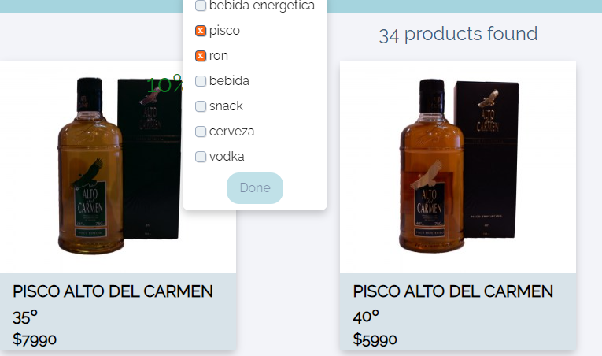
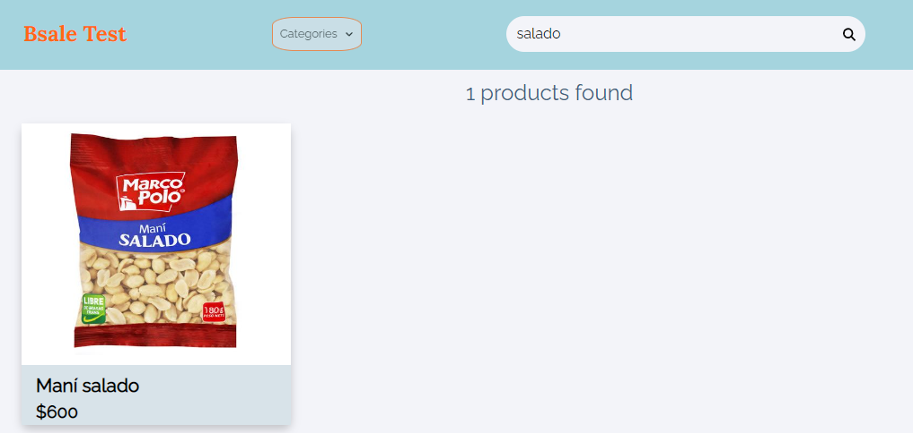
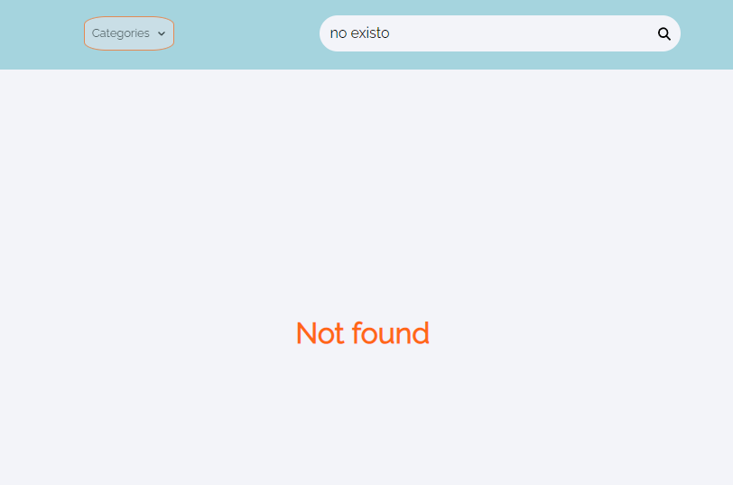
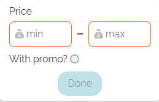
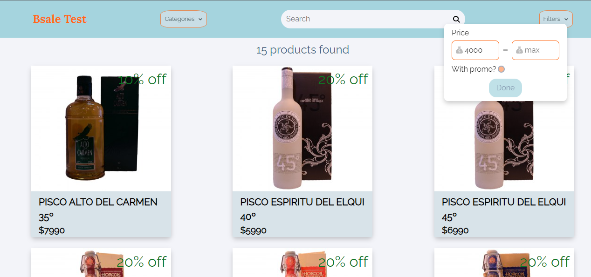

# BSale Test Online Shop

Esta aplicación se encuentra hosteada en: https://bsale-test-online-shop-6xsxpo55k-rodrigolopez160795.vercel.app/

Al inicio de la aplicación se desplegara el homePage el cual se vera de esta forma:
.

Existen 3 tipos de filtros en la aplicación web. Para todos los filtros es necesario presionar el boton de "Done" o la lupa en el buscador para que se aplique la busqueda.

1. Filtro por categorias:
   .
   Aqui permite seleccionar una o mas categorias devolviendo los productos filtrados por las categorias seleccionadas.
   .

2. Barra de busqueda:
   .
   Se trata de un buscador. Basta con escribir una palabra o frase. En caso de que se encuentre en la base de datos devolvera el o los productos que encuentre.
   .

   En caso de que no encuentre nada devolvera la frase "Not found".
   .

3. Filtro por precio o descuento.
   .
   Este filtro puede o no tener todos los campos. Va a devolver los productos que cuenten con los campos que se llenen.
   .

### Nota: **Todos los filtros se limpian despues de hacer la busqueda**
